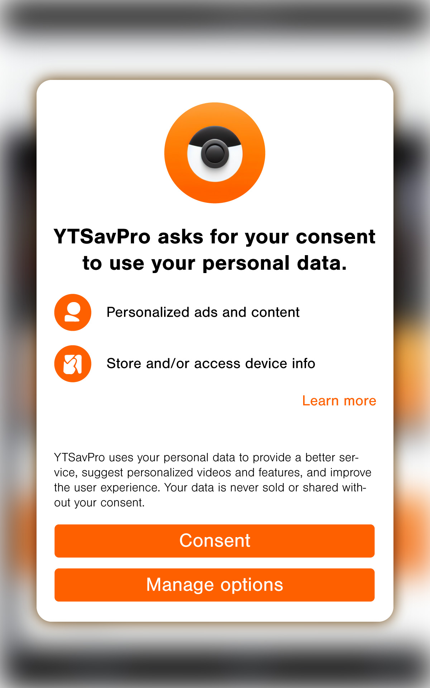
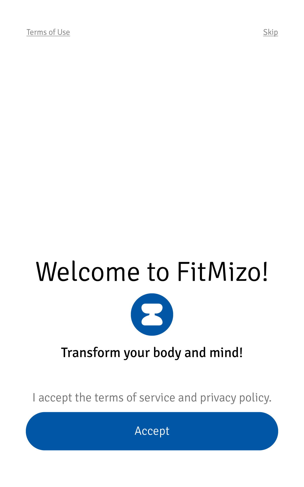

Tracking happens everywhere, all the time, spanning across multiple websites and applications. All for getting the perfect, all-encompassing image of every single user, supposedly to "personalise their experience". I think we don't need to specify that that is happening exclusively for the benefit of the companies and not to give the users a better experience. Especially since those practices entail severe risks and negative consequences for said users. Not one of us is thrilled to find out that companies [collect information](https://www.datarequests.org/blog/android-data-safety-labels-analysis/) about our health conditions, sexual orientation, income level, and so much more, just to find the best way to manipulate and trigger us, but more on that later. Thankfully, it is not only "not so nice" of the companies to do that. The [data](https://edpb.europa.eu/sites/default/files/files/file1/edpb_guidelines-art_6-1-b-adopted_after_public_consultation_en.pdf) [protection](https://www.datenschutzkonferenz-online.de/media/oh/20221130_OH_Telemedien_2021_Version_1_1.pdf) [authorities](https://www.baden-wuerttemberg.datenschutz.de/wp-content/uploads/2022/03/FAQ-Tracking-online.pdf) [clearly](https://ec.europa.eu/justice/article-29/documentation/opinion-recommendation/files/2013/wp203_en.pdf) [state](https://ec.europa.eu/justice/article-29/documentation/opinion-recommendation/files/2014/wp217_en.pdf) that tracking without consent is typically illegal.

Since starting our work, we have realised that a lot of times, companies are not open and honest about the data they track. It's also not uncommon for them to not even know what they are tracking, since most of it is happening through third-party tracking companies. But if they are not able or willing to provide the requested information, we must find another way. So, instead of asking, we began looking, and oh girl, did we find a lot of things!

We have analysed the tracking behaviour of thousands of apps. [Almost all of them](https://static.dacdn.de/talks/slides/2023-04-17-edpb-expert-talk.pdf#page=18) were sending information to tracking companies. And that even before we started to interact with them—we simply opened the apps without clicking anywhere after that. All of this tracking information then gets sent to [Google, Facebook, and a long list](https://static.dacdn.de/talks/slides/2023-04-17-edpb-expert-talk.pdf#page=19) of even more mostly unknown tracking companies. It is shocking to see that [a third of all requests](https://static.dacdn.de/talks/slides/2023-04-17-edpb-expert-talk.pdf#page=21) the apps made were sent to tracking companies. Keep in mind that these requests are neither for the functionality of the app nor for the experience of the user. They are simply there to analyse the users' behaviour. When we looked at all [the data the apps collected](https://static.dacdn.de/talks/slides/2023-04-17-edpb-expert-talk.pdf#page=22), we saw a similar picture. Most of what the apps were gathering wasn't important for the functionality of the app or other plausible reasons. It was part of the user analysis.

This is not only draining the users' bandwidth, but it also makes it very hard to do anything without these companies' knowledge. So be aware that as soon as you download a popular app, a whole bunch of companies will probably know what you and your phone are doing, considering the vast amount of information about the inner workings of your phone that will get tracked too. Think of data points like the phone model, charging status, operating system version, volume, screen brightness, device orientation, screen time, and so many other things. You will see more technical details if you start analysing apps yourself with the help of Tweasel. As we're not providing any other input, such parameters are simply the only thing that can be tracked. But don't be fooled by these seemingly unimportant data points. Even without actually substantial information, the tracking companies will make assumptions about the users and categorise them into segments. [Those segments](https://netzpolitik.org/2023/surveillance-advertising-in-europe-the-adtech-industry-tracks-most-of-what-you-do-on-the-internet-this-file-shows-just-how-much/) can vary widely between seemingly innocent things along the lines of *charges their phone frequently* or *uses Firefox as their main browser* and more serious and harmful segments like *low income without perspective*, *heavy alcohol consumers*, or *easy to manipulate*. It is ridiculous to assume these things about someone simply based on their phone data or whatever the trackers can find. We highly doubt that those profiles are even close to the truth. Although we don't know with certainty what companies do with these profiles, it is not difficult to imagine, for example, that the income segment that you fall into will influence what type of offers and prices you will encounter while online shopping.

At this point, it is important to emphasise that the data is often not anonymised. In most cases, it will get pseudonymised, but that only means that it isn't your name on the cover but instead an ID number, which isn't any better. You see, unlike a name, those IDs are actually unique and specific to a person, and they make it possible to connect tracking data to the user. Furthermore, this is highly concerning since companies trade IDs with each other, which makes it possible to follow users across multiple apps and websites, always knowing exactly who those data points belong to. When you provide information like your name, address, age, etc., to a website or an app, trackers have the opportunity to link it to your IDs.

And not only that, even if a website or an app is asking for your consent, chances are the consent dialog isn't holding up to the legal requirements, either. Welcome to the world of "dark patterns", where companies design their consent requests in a way that makes it really easy to agree and nearly impossible to reject. Just so you know, if a consent form does not show you the reject button with the same prominence—on the exact page site, with the same size, similar colour, etc.—as the accept button, it is [considered invalid by the data protection authorities](https://benjamin-altpeter.de/tracking-legal-requirements/), and therefore cannot acquire actually consent.

<figure>

<figcaption>Reject button is not on the same page</figcaption>
</figure>

<figure>

<figcaption>Reject button is hidden in the corner, a different size and colour, and ambiguously labelled</figcaption>
</figure>

So, knowing all of that, what can you do now? While there are defenses that people with technical knowledge can use to protect themselves against tracking, we firmly believe that data protection is a fundamental right that applies to everyone, regardless of technical expertise and what apps and services they use. On paper, the law is on our side. As we've seen, the data protection authorities already interpret the GDPR and ePrivacy Directive as meaning that most of what we've described here is illegal.

But unfortunately, enforcement is lacking. Illegal tracking rarely has any consequences for companies. That's what we want to help change with Tweasel. Not only can Tweasel give you insight into what apps track about you, it can also assist you in demanding the app developers to stop that and if they don't, you can complain with the data protection authorities. We hope that together, we can bring more attention to the problem and put pressure on the tracking companies.
